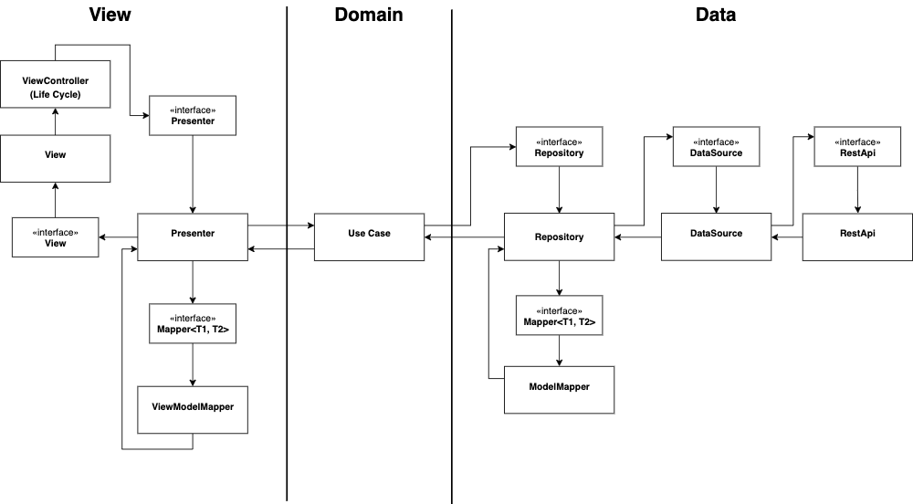
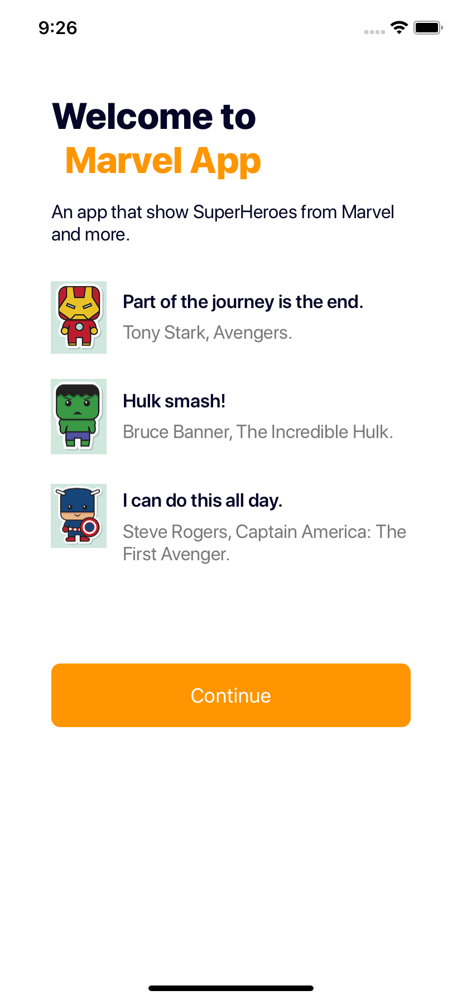
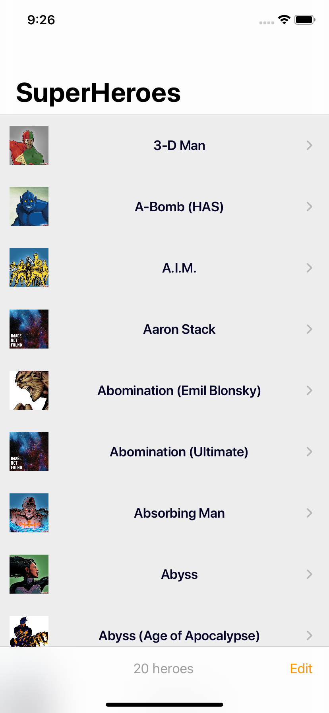
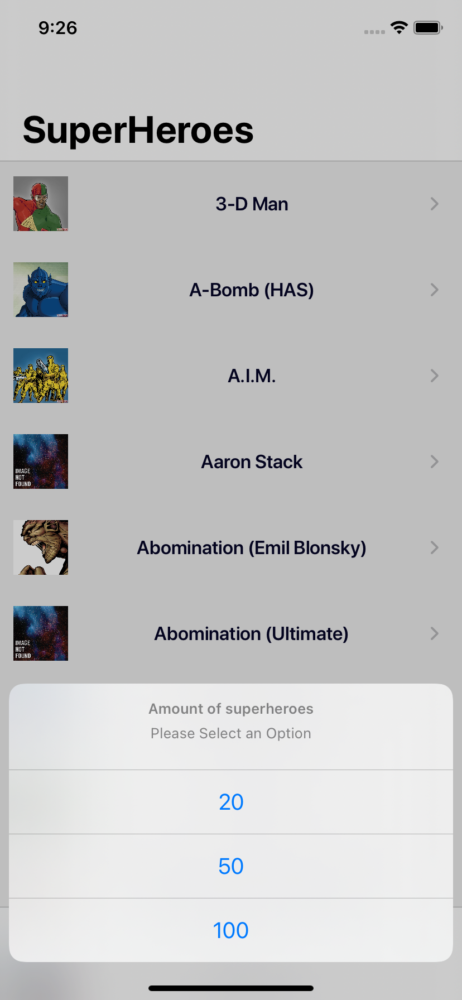
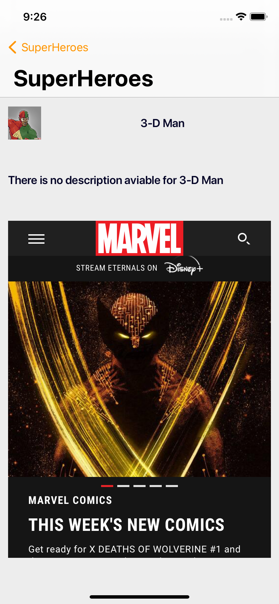
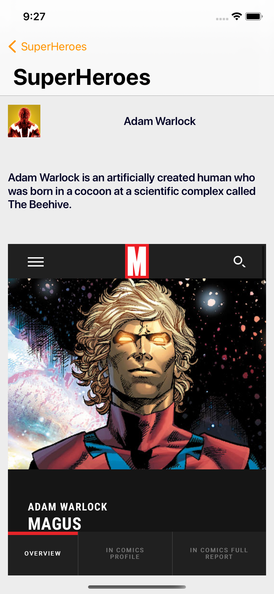

# Mobile-Test-Marvel
This project repository contains all the files used in the Marvel iOS App.

## Requirements
- XCode 13.1+

## How to install
Clone the repository
```ruby
git clone https://github.com/dromerobarria/Mobile-Test-Marvel.git
```
Go to the `Marvel` folder
```ruby
cd Marvel
Tuist generate 
pod install
```

Extra: In the case Realm(Data base pod) present problem in Xcode, please run

```ruby
pod deintegrate || rm -rf Pods
pod install --repo-update --verbose
```


## Tips

*For the DB it was used Realm

*To generate the project It use Tuist (https://tuist.io)

*External Depency using Cocoapods

*For UI test it was use SnapShot but must do a configure to use it in the pipeline, so for now there are just image as references.

*Pipeline was using GithubActions

*Danger was use for the coverage (At the moment is 40% coverage to keep on PRs, could be more but should be upgrade coverage for cell/viewController/Presenter of the superHeroesList flow)

## Git Workflow
It was using the standard [GitFlow](https://www.atlassian.com/git/tutorials/comparing-workflows/gitflow-workflow).

## Architecture
It was build following Clean Architecture and MVP with Repository pattern 



## Aproach problem

The app containst 3 mayor flows

*Grettings to manage some introductions of the app




*SuperHeroesList to present and request the superheroes from marvel api, it can be edit to request diferents amounts of heroes (29,30 ....) 




*SuperHeroeDetail to show some description of the superheroe, and call the wiki url in the screen



